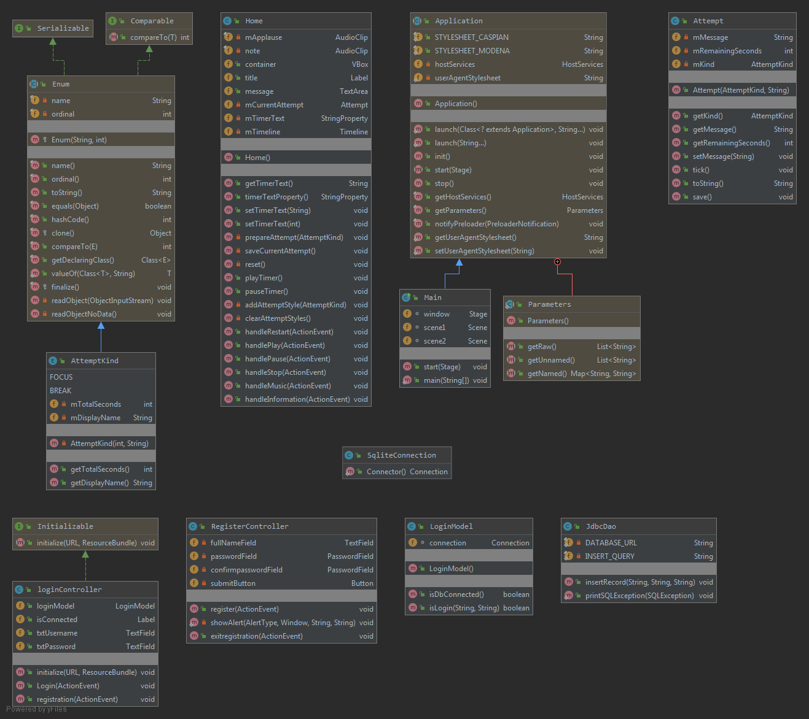
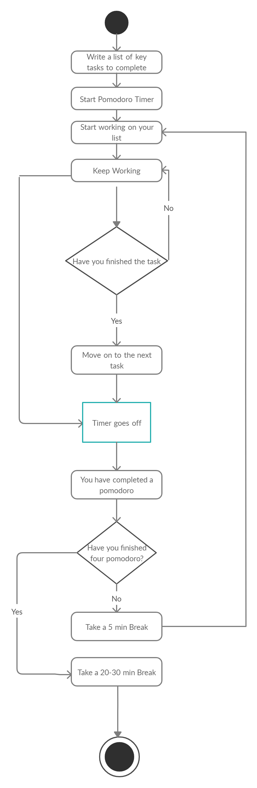
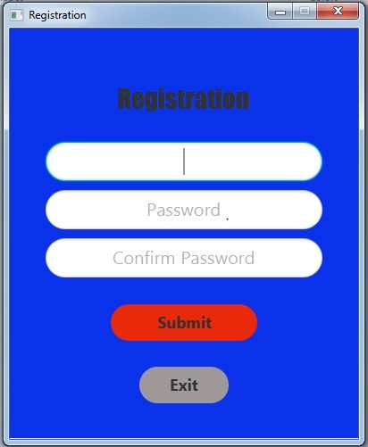
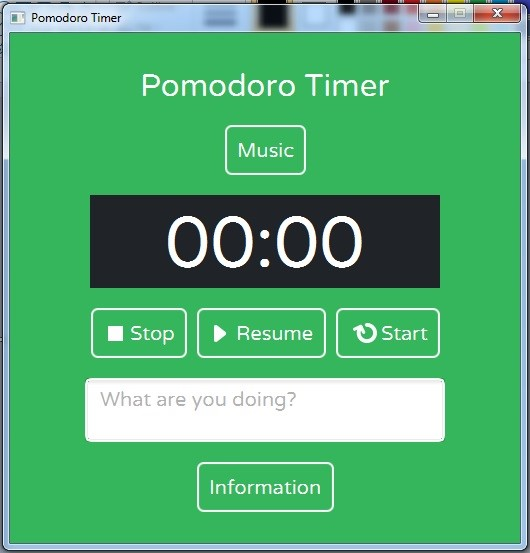
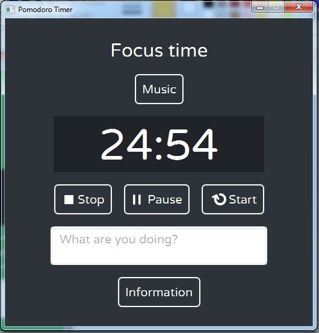
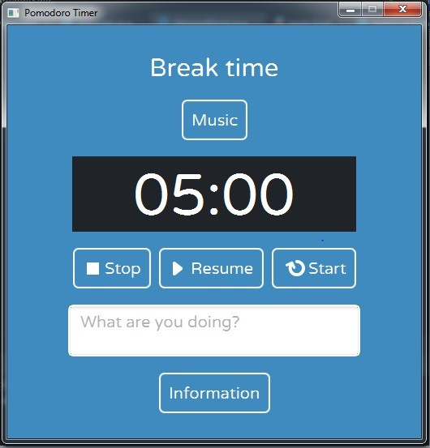

# PomodoroTimer
It's a **Pomodoro** timer made with JAVAFX and (MSAccess DB for login.)
I would have use SQlite but it was my college requrirement to use MS Access .

## Documentation
<a href="documentation/POMODORO%20Documentation.docx">Docx - 31 Pages</a>
According to SPPU Documentation Norms.
## Diagrams and Forms
### Class Diagram

F - Field , M* - Constructor , M – Method , C - Class

### Activity Diagram

### Login Form & Registration Form
 

### Main Form

### Focus Form & Break Form.jpg
 
